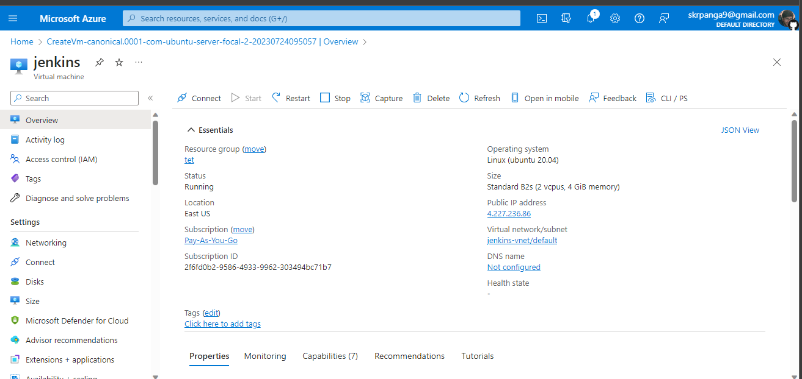
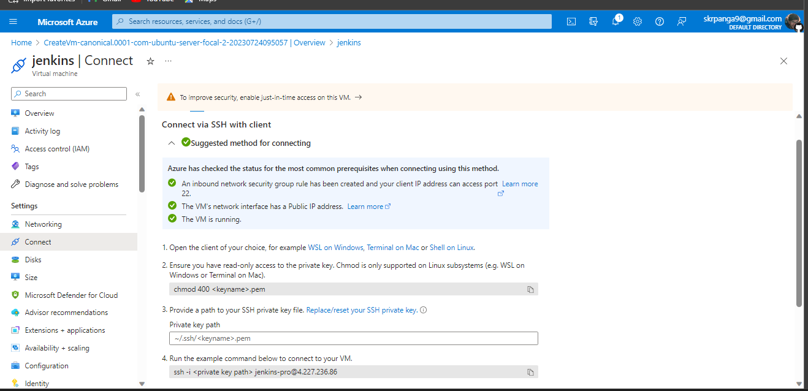
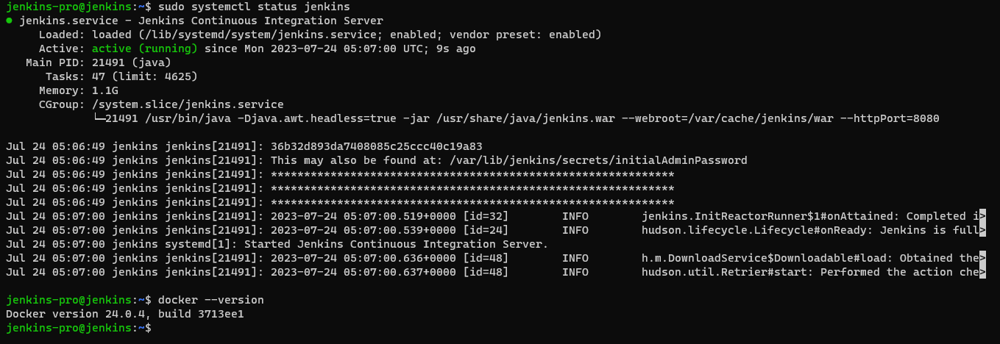
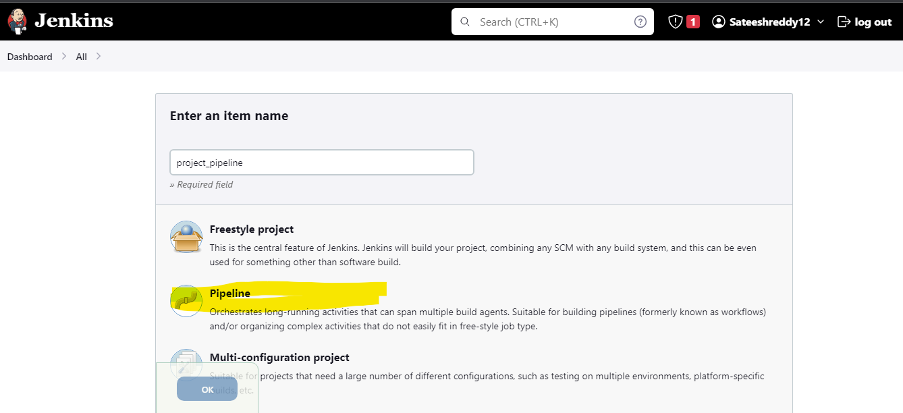
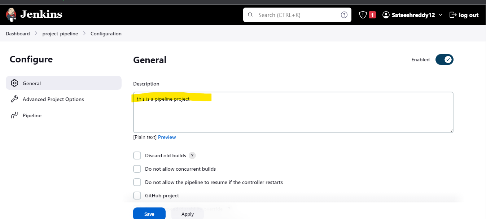

### Deploying web app using Jenkins CI/CD declarative pipeline.
    Follow the steps:

1. First of all, go to the AWS portal, and create a new instance. As

 Name: jenkins
 AMI: ubuntu.
 VM type: Standard B2s
 Key pair login: Create password or else pem file as your choice
 Allow HTTP.
 Allow HTTPS.

 ## Click on to connect virtual machine
 

2. Now, we will allow ports 8080 and 8001 for this machine from a security group. We can find the security group in the VM description. Now, here we need to allow “Inbound Rule”
  

3. Now, connect to the Virtual Machine that you have created. Copy the SSH from the server

4. Install java version Using Following Command
---
sudo apt install openjdk-17-jdk -y
---

5. Install Jenkins from the following Steps
---
curl -fsSL https://pkg.jenkins.io/debian-stable/jenkins.io-2023.key | sudo tee \
  /usr/share/keyrings/jenkins-keyring.asc > /dev/null
echo deb [signed-by=/usr/share/keyrings/jenkins-keyring.asc] \
  https://pkg.jenkins.io/debian-stable binary/ | sudo tee \
  /etc/apt/sources.list.d/jenkins.list > /dev/null
sudo apt-get update
sudo apt-get install jenkins
---

6. Install Docker from thr following Steps
---
curl -fsSL https://get.docker.com -o install-docker.sh
 cat install-docker.sh
 sh install-docker.sh --dry-run
 sudo sh install-docker.sh
---

7. Now check if it got installed by running “jenkins — version” and “docker — version”

8. Goto Jenkins Dashboard and Click on “New Item”

 Name: project_pipeline

 Select: Pipeline

Description: This is a pipeline project.

